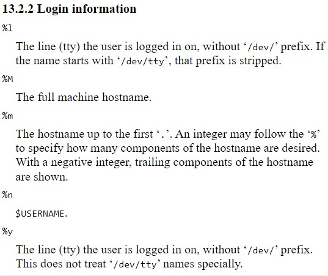

*__Customising the Shell Prompt__*

-----

__Preface__: This is a topic I am not too keen to pursue further for now. So, this will be short. _(Though the Github project linked below looks interesting to check out.)_

On opening your terminal, you have noticed a text that always appears before you start typing your commands. This is the __shell prompt__.

`[me@linuxbox ~]$`

The prompt (text above) can be customised using a strict set of codes that vary depending on the shell installed your system.

There are a lot of codes that frankly are quite weird to first look at and then creating a prompt from the combination of these. I'll just put up a table of shell prompt codes for Z shell.

This is just a handful of all the different codes that are supported by Zsh. These can be [somewhat different](https://tldp.org/HOWTO/Bash-Prompt-HOWTO/bash-prompt-escape-sequences.html) on Bash.

The prompts can range from just a simple `$` to [this monstrosity](https://i.imgur.com/fduQPSi.png) using __just__ zsh prompt codes.

----

_Some useful sites:_

_- [r/bash](https://www.reddit.com/r/bash/) and [r/unixporn](https://www.reddit.com/r/unixporn/)_

_- For reading more about zsh: [zsh docs](https://zsh.sourceforge.io/Doc/Release/zsh_toc.html)_

_- Lastly, I found this [Github project](https://github.com/brujoand/sbp) and this looks like a cool project to contribute to and learn more about._