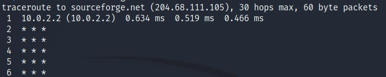

*__Storage Media__*

-----

Preface: This is a topic that is very broad in nature and the book only touches upon a very small subset of concepts and commands that a beginner can easily grasp and reasearch more about. This is my final goal of learning networking in general thus, I will add a few more resources that I had previously found very helpful and _a bit advanced_ for a beginner.

---

Linux is used to build all sorts of networking systems and appliances, including firewalls,
routers, name servers, NAS (Network Attached Storage) boxes and on and on. A Linux user can take a look at a few commands for basic troubleshooting.

- `ping`: used for sending a ICMP ECHO_REQUEST to a server or hostname. The command displays statistics of individual packets received from the host as well as displays overall statistics of the complete transmission. A properly performing network will exhibit zero percent
packet loss. A successful “ping” will indicate that the elements of the network (its interface cards, cabling, routing, and gateways) are in generally good working order.

- `traceroute`: displays a listing of all the “hops” network traffic takes to get from the local system to a specified host. Sometimes, the command will display the below output. The `* * *` means that the hops taken from this router do not provide identity information due to some network or firewall configuration.

- `netstat`: used to examine various network settings and statistics. There are many commands that are pretty useful for looking into the routing table, network interfaces etc. The man page of `netstat` will be helpful to learn more about them.

- `ftp`: used for communicating with computers on the network using the FTP protocol. FTP allows computers to upload and download files in a network. But, the major drawback is that the data is sent in cleartext on the network.

- `wget`: used for downloading files from both web and FTP sites. There is another alternative `curl` but both have [a very major difference](https://daniel.haxx.se/docs/curl-vs-wget.html) in how they download files. The man pages of `wget` are very good resource for testing different options.

- `ssh`: To address the vulnerabilities of `ftp`, `ssh` is used to create a secure connection with a remote host. Computerphile has made a really good video on how this protocol works. You can check that out. (Linked below) One caveat is that a ssh server should be running on the host machine that you want to communicate with. `ssh` command is used to connect using the host's ip and password. 
After successfully connecting with a remote host, the `ssh` store all the authentication credentials of the remote host in `~/.ssh/known_hosts` file. Sometimes while connecting with a remote host, the connection can be severed due to the protocol not being able to authenticate the host. This could be due a `man-in-the-middle` attack or most probably a change in the host's SSH or system configuration.

Secure alternatives of `ftp` and `cp` command have been built that use SSH protocol for communication.
`scp` command is used for copyting files between or within the host or between the client and the host. Similarlt, `sftp` command allow secure file uploading and downloding. `sftp` protocol is supported by many file managers like Nautilus on GNOME and Konqueror on KDE.

---

_Useful links:_

- [_How SSH works?_](https://www.youtube.com/watch?v=ORcvSkgdA58)

- [_Diffie-Hellman Key Exchange (Useful for understanding how SSH establishes a tunnel)_](https://www.youtube.com/watch?v=NmM9HA2MQGI)

- [_Networking 101_](https://www.youtube.com/playlist?list=PLDQaRcbiSnqF5U8ffMgZzS7fq1rHUI3Q8)

- [_The OG - Eli The Computer Guy_](https://www.youtube.com/user/elithecomputerguy)

- [_Linux Network Administrator’s Guide_](https://tldp.org/LDP/nag2/index.html)